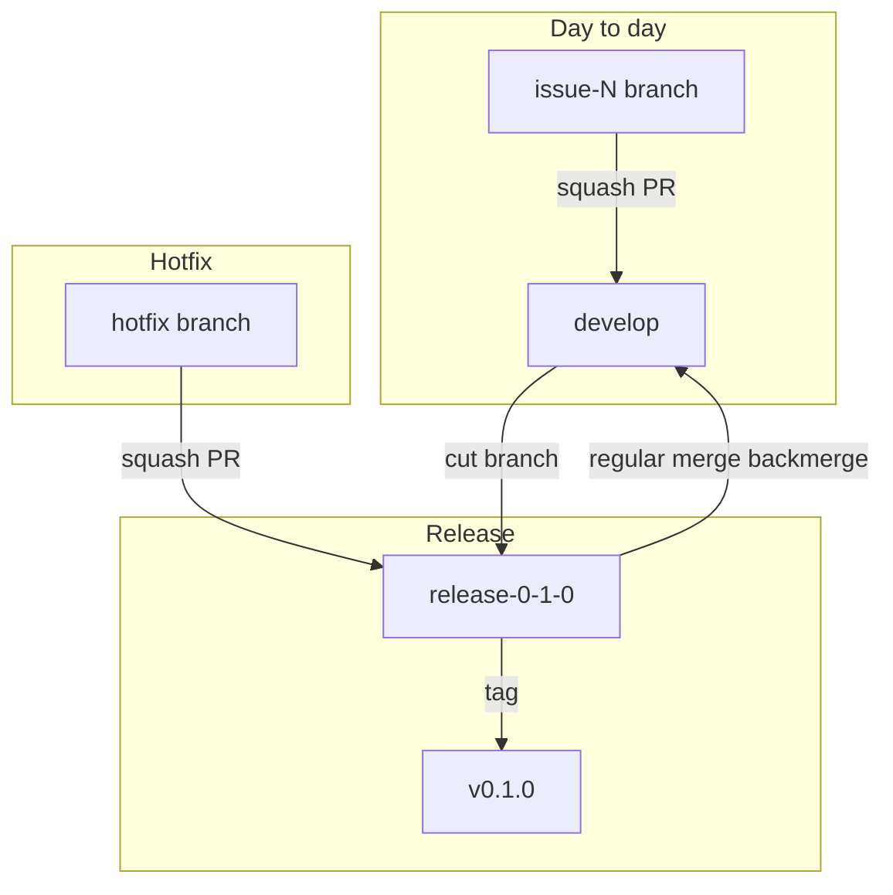
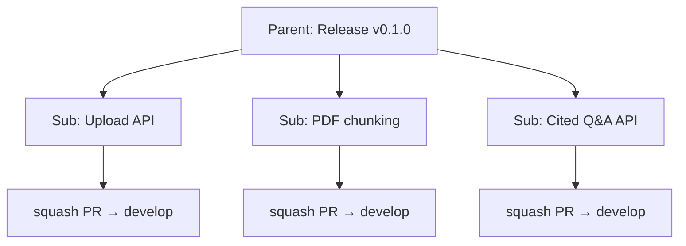

# Issue and PR workflow (reference)

Canonical templates for GitHub issues and pull requests. Agents must follow [AGENTS.md](../../AGENTS.md) **Development workflow**; this doc is the detailed model.

## Branching and releases

**No `main` or `master`.** Only **`develop`** and **`release-*`** branches.

| Branch | Purpose |
|--------|---------|
| `develop` | Integration — all sub-issue PRs **squash-merge** here |
| `release-X-Y-Z` | Shipped minor (e.g. `release-0-0-0` for `v0.0.0`) — cut from `develop`; hotfixes land here |



### Release flow

1. Sub-issues merge to **`develop`** via **squash** PRs.
2. Test together on **`develop`**.
3. Cut **`release-X-Y-Z`** from `develop` (e.g. `release-0-0-0`).
4. Tag on the **release branch** (e.g. `v0.0.0`).
5. Record tag on the parent issue; close the parent manually when release criteria are met.

**v0.0.0 dry run:** squash-merge planning work to `develop` first; cut `release-0-0-0` later in the dry run.

### Hotfix flow

1. Branch from **`release-X-Y-Z`** (not `develop`).
2. **Squash merge** PR into the release branch.
3. **Regular merge** (backmerge) `release-X-Y-Z` → `develop` so patches are not lost.
4. Tag patch on release branch if needed (`v0.1.1`).

**Rule:** A release branch must **not** remain ahead of `develop` — backmerge after every hotfix.

### Merge methods (required)

| PR type | Base branch | Merge method |
|---------|-------------|--------------|
| Sub-issue / feature | `develop` | **Squash** |
| Hotfix | `release-X-Y-Z` | **Squash** |
| Backmerge | `develop` | **Merge** (regular merge commit) |

---

## Issue hierarchy (required for each minor version)

Every planned minor release (e.g. `v0.1.0`) uses:

1. **One parent issue** — the release milestone.
2. **Multiple sub-issues** — the parts we implement and merge via PRs.



**Rules**

- Create the **parent first**, then sub-issues; link sub-issues to the parent using GitHub **sub-issues**.
- Agents implement **sub-issues only** — one sub-issue per branch/PR.
- **Link every working branch** on the sub-issue (**Development** sidebar).
- PRs to `develop` **squash merge** with **`Implements`** linking only the **sub-issue** (full issue URL on the first line).
- **Bug fixes** during testing → **new sub-issue** under the parent (never drive-by on another branch).
- After all subs on `develop`: cut `release-X-Y-Z`, tag, close parent when release criteria are met.

### Labels and milestones (required)

| Item | Milestone | Labels |
|------|-----------|--------|
| Parent release issue | Minor version (`v0.0.0`, `v0.1.0`, …) | `release` |
| Sub-issue | Same as parent | e.g. `documentation`, `planning`, `enhancement`, `stage:0` |
| Pull request | Same as sub-issue | Match sub-issue type labels |

Create the **milestone first** (one per minor version):

```bash
gh api repos/Bmsandoval/covered/milestones -f title="v0.1.0" -f description="…"
```

Apply when creating or after filing:

```bash
gh issue edit <parent> --milestone "v0.0.0" --add-label "release"
gh issue edit <sub> --milestone "v0.0.0" --add-label "documentation,planning,stage:0"
gh pr edit <pr> --milestone "v0.0.0" --add-label "documentation,planning"
```

**Stage labels:** `stage:0` … `stage:9` aligned with [staged-solution-plan.md](./staged-solution-plan.md).

### Link branch and PR (Development section)

**Before the first commit** (required):

```bash
git checkout develop && git pull
gh issue develop <issue-number> --name issue-<issue-number>-<short-slug> --checkout --base develop
# commit, push, then open PR
```

**Branch already on remote without link:** sub-issue → **Development** → **Link a branch** → `issue-<N>-<slug>`. Do not use GraphQL `createLinkedBranch` (wrong branch name).

**PR first line (required):**

```text
Implements https://github.com/Bmsandoval/covered/issues/<sub>
```

Squash-merge to `develop` closes the **sub-issue**. The **parent** is tracked via GitHub **sub-issue** relationships and closed manually when the release ships. Link branch/PR on the **sub-issue** Development panel (no parent/PR/planning links needed in issue bodies).

**Parent release issues** do not get feature branches — only **sub-issues** do.

---

## Release parent issue template

**Title:** `Release v0.1.0 — <short milestone name>`

```markdown
## Summary

One paragraph: what this minor version delivers.

## Target tag

`v0.1.0`

## Release branch

`release-0-1-0` (cut from `develop` after sub-issues merge and test)

## Sub-issues

- [ ] #__ — <title>

## Release acceptance criteria

- [ ] All sub-issues closed (squash-merged to `develop`)
- [ ] Tested on `develop`
- [ ] `release-0-1-0` cut from `develop` and pushed
- [ ] Tag `v0.1.0` on release branch and pushed
- [ ] Tag recorded on this issue

## Test plan (release batch)

- [ ] …
```

---

## Sub-issue template

**Title:** Short, imperative — e.g. `Add PDF upload endpoint`

```markdown
## Problem

…

## Goal

…

## Acceptance criteria

- [ ] …
- [ ] PR **squash-merged** to `develop`

## Out of scope

- …
```

Link the sub-issue to its parent in GitHub (**sub-issues** under the parent). Do not repeat parent/PR/planning links in the body — the **Development** panel shows the linked branch and PR.

---

## Pull request template

**Branch name:** `issue-<number>-<very-short-description>`

**PR title:** `Issue-<number> - <slightly longer description>`

**Base branch:** `develop` (features) or `release-X-Y-Z` (hotfixes only)

**Merge:** **Squash** (features and hotfixes); **regular merge** for backmerge PRs only.

```markdown
Implements https://github.com/Bmsandoval/covered/issues/<sub>

## Summary

<Problem in 1–2 sentences.>

<Approach in 1–2 sentences.>

## Changes

- …

## Test plan

- [ ] …
```

---

## No tool branding

Do **not** include “Made with Cursor”, “AI-generated”, or similar in issues, PRs, commits, or release notes. **Remove** any Cursor footer GitHub appends before merge. See [AGENTS.md](../../AGENTS.md).

---

## Linking checklist

**When creating a minor version**

- [ ] Milestone created (e.g. `v0.0.0`)
- [ ] Parent issue + milestone + `release` label
- [ ] Sub-issues linked as sub-issues of parent; same milestone + labels

**When starting work (sub-issue)**

- [ ] Linked branch on **Development** (`gh issue develop` or manual link)
- [ ] Branch from `develop`

**When opening a PR (sub-issue)**

- [ ] Base: **`develop`**
- [ ] Merge method: **squash**
- [ ] First line: `Implements https://github.com/Bmsandoval/covered/issues/<sub>`
- [ ] No Cursor / “Made with” footer in PR body
- [ ] Backlink on sub-issue; PR under **Development**
- [ ] Milestone and labels on PR

**When releasing**

- [ ] All sub-issues squash-merged to `develop`
- [ ] Test on `develop`
- [ ] Cut `release-X-Y-Z` from `develop`
- [ ] Tag on release branch; close parent when release criteria are met

**When hotfixing a release**

- [ ] PR into `release-X-Y-Z` — squash merge
- [ ] Backmerge `release-X-Y-Z` → `develop` — **regular merge**
- [ ] Release branch not left ahead of `develop`
