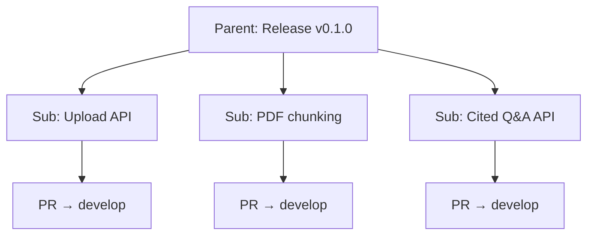

# Issue and PR workflow (reference)

Canonical templates for GitHub issues and pull requests. Agents must follow [AGENTS.md](../../AGENTS.md) **Development workflow**; this doc is the detailed model.

## Branching and releases

| Branch | Role |
|--------|------|
| `develop` | Integration branch — **all PRs merge here** |
| `main` | Stable line — receives **minor releases** after we test together on `develop` |

**Release flow**

1. Work lands on `develop` via issue-linked PRs.
2. We test the batch on `develop` together before promoting.
3. Merge `develop` → `main` for a minor release.
4. Tag the release commit on `main` (e.g. `v0.2.0`).
5. Update the related issue(s) with the release tag and close if complete.

Do not merge unreviewed work directly to `main`. Do not skip joint testing for minor releases.

---

## Issue hierarchy (required for each minor version)

Every planned minor release (e.g. `v0.1.0`) uses:

1. **One parent issue** — the release milestone.
2. **Multiple sub-issues** — the parts we implement and merge via PRs.



**Rules**

- Create the **parent first**, then sub-issues; link sub-issues to the parent using GitHub **sub-issues** (Issues → parent → add sub-issue).
- Agents implement **sub-issues only** — one sub-issue per branch/PR.
- **Link every working branch** on the sub-issue (**Development** sidebar) before or right after the first push.
- PRs **`Closes #N`** the **sub-issue** number.
- Close the **parent** only after: all sub-issues closed, joint test on `develop`, merge to `main`, git tag pushed, tag recorded on parent.

### Link branch to sub-issue (Development section)

GitHub only shows work on the issue when the branch (and/or PR) is linked under **Development**.

**Create linked branch (recommended):**

```bash
git checkout develop && git pull
gh issue develop <issue-number> --name issue-<issue-number>-<short-slug> --checkout --base develop
```

**Branch already pushed but not linked:** On the sub-issue → **Development** → **Link a branch** → select e.g. `issue-3-planning-docs`.

**Verify:** Issue sidebar **Development** lists the branch; after PR open, the PR should appear (branch may be folded into PR — OK).

### Labels and milestones (required)

| Item | Milestone | Labels |
|------|-----------|--------|
| Parent release issue | Minor version (`v0.0.0`, `v0.1.0`, …) | `release` |
| Sub-issue | Same as parent | e.g. `documentation`, `planning`, `enhancement`, `stage:0` |
| Pull request | Same as sub-issue | Match sub-issue type labels |

Create the **milestone first** (one per minor version):

```bash
gh api repos/Bmsandoval/covered/milestones -f title="v0.1.0" -f description="…"
```

Apply when creating or after filing:

```bash
gh issue edit <parent> --milestone "v0.0.0" --add-label "release"
gh issue edit <sub> --milestone "v0.0.0" --add-label "documentation,planning,stage:0"
gh pr edit <pr> --milestone "v0.0.0" --add-label "documentation,planning"
```

**Stage labels:** `stage:0` … `stage:9` aligned with [staged-solution-plan.md](./staged-solution-plan.md).

---

## Release parent issue template

**Title:** `Release v0.1.0 — <short milestone name>`  
Example: `Release v0.1.0 — Insurance MVP`

```markdown
## Summary

One paragraph: what this minor version delivers and why it exists.

## Target tag

`v0.1.0`

## Sub-issues

Create these as sub-issues of this parent (check off as filed):

- [ ] #__ — <title>
- [ ] #__ — <title>
- [ ] #__ — <title>

## Release acceptance criteria

- [ ] All sub-issues closed
- [ ] Tested together on `develop` (see test notes below)
- [ ] `develop` merged to `main`
- [ ] Tag `v0.1.0` on `main` and pushed
- [ ] Release notes / tag recorded here

## Test plan (release batch)

- [ ] End-to-end scenario 1
- [ ] End-to-end scenario 2

## Links

- Planning: `docs/planning/staged-solution-plan.md`
- Tag: (fill after release — e.g. `v0.1.0`)
```

**Parent issues do not usually get implementation PRs** — only sub-issues do. Exception: a dedicated “Promote v0.1.0 to main” PR may `Refs` the parent.

---

## Sub-issue template

**Title:** Short, imperative — e.g. `Add PDF upload endpoint`

```markdown
## Parent release

Part of **Release v0.1.0** — #<parent_issue_number>

## Problem

One or two sentences: what user or system pain exists, and why it matters now.

## Goal

One sentence: what “done” looks like from the user’s perspective.

## Acceptance criteria

- [ ] Criterion 1
- [ ] Criterion 2
- [ ] Criterion 3

## Approach (optional)

Broad technical direction if already agreed — not a full design doc.

## Out of scope

- Thing we are explicitly not doing in this issue

## Links

- Parent: https://github.com/Bmsandoval/covered/issues/<parent>
- Planning: `docs/planning/...` (if any)
- PR: (add when opened — `https://github.com/Bmsandoval/covered/pull/N`)
```

### Example sub-issue

**Title:** Load configuration from `local.env` in development  
**Parent:** Release v0.1.0 — #1

## Problem

The app has no standard way to read settings locally; developers need a single, documented env source before we add a database or LLM keys.

## Goal

The server starts in development using variables from `local.env` with clear errors when required keys are missing.

## Acceptance criteria

- [ ] `ex.env` documents all keys; `local.env` is gitignored
- [ ] Dev entrypoint loads `local.env`
- [ ] Missing required keys produce a actionable error message

## Out of scope

- Production secret manager integration
- Per-environment config UI

## Links

- Parent: https://github.com/Bmsandoval/covered/issues/1
- PR: https://github.com/Bmsandoval/covered/pull/12

---

## Pull request template

**Branch name:** `issue-<number>-<very-short-description>` — e.g. `issue-12-local-env-config`

**PR title:** `Issue-<number> - <slightly longer description>` — e.g. `Issue-12 - Load dev config from local.env`

**Title (optional subtitle):** May mirror PR title; include `(#N)` if helpful — e.g. `Load dev config from local.env (#12)`

**Body:**

```markdown
Closes #12

## Summary

<1–2 sentences: the problem being solved.>

<1–2 sentences: broadly what we are doing to solve it.>

## Changes

- Bullet: concrete change 1
- Bullet: concrete change 2
- Bullet: tests or docs updated

## Test plan

- [ ] How we verified (or how the reviewer should verify)

## Issue

- https://github.com/Bmsandoval/covered/issues/12
```

Use `Closes #N` when the PR fully completes the issue (auto-closes on merge). Use `Refs #N` only for partial work that leaves the issue open.

### Example PR

**Title:** Load dev config from `local.env` (#12)

```markdown
Closes #12

## Summary

Developers had no shared way to inject API keys and ports locally, which blocked standing up ingestion and chat spikes.

This PR adds a small config loader that reads `local.env` in development and validates required keys at startup.

## Changes

- Add `config` package that loads `local.env` when `APP_ENV=development`
- Document keys in `ex.env`; fail fast with missing-key messages
- Add unit tests for load and validation paths

## Test plan

- [ ] `cp ex.env local.env`, set `APP_PORT`, run server — listens on configured port
- [ ] Remove required key — startup prints clear error

## Issue

- https://github.com/Bmsandoval/covered/issues/12
```

---

## No tool branding

Do **not** include “Made with Cursor”, “AI-generated”, Copilot/Claude co-author trailers, or similar in issue titles, issue bodies, PR descriptions, commit messages, or release notes. See [AGENTS.md](../../AGENTS.md).

---

## Linking checklist

**When creating a minor version**

- [ ] Milestone created for minor version (e.g. `v0.1.0`)
- [ ] Parent release issue created with target tag (e.g. `v0.1.0`), milestone, label `release`
- [ ] Sub-issues created and attached to parent in GitHub; same milestone + labels
- [ ] Parent body lists all sub-issue numbers

**When starting work (sub-issue)**

- [ ] Branch created with `gh issue develop <N> --name issue-<N>-<slug> --checkout --base develop`, **or** existing branch linked via **Development → Link a branch**
- [ ] Branch visible on sub-issue **Development** before or immediately after first push

**When opening a PR (sub-issue)**

- [ ] PR targets **sub-issue** with `Closes #N`
- [ ] Body includes full sub-issue URL under **Issue**
- [ ] Comment on **sub-issue** with PR link (backlink)
- [ ] PR appears under **Development** on the sub-issue
- [ ] PR has same **milestone** and **labels** as sub-issue (`gh pr edit …`)
- [ ] Optional: comment on **parent** with progress note when a major sub-issue merges

**When releasing**

- [ ] All sub-issues for the parent are closed
- [ ] Joint test on `develop` completed
- [ ] Tag on `main`: `git tag -a v0.1.0 -m "..."` && push tag
- [ ] Add tag to **parent** issue **Links** section
- [ ] Close **parent** release issue
