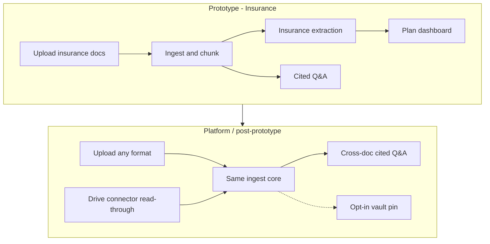
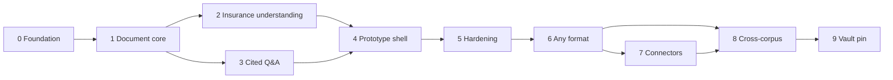

# Staged solution plan

Problem restatement and phased delivery for Covered.

- **Primary offering:** citation-based Q&A over the user’s data (any supported format, over time).
- **Prototype (now):** insurance documents via **upload** — thin `v0.x` releases ([product-phases.md](./product-phases.md)).
- **MVP (later):** shippable product beyond prototype (`v1.x` TBD).
- **Platform (later):** cloud **connectors**, cross-corpus search, **opt-in vault storage**.

**Execution:** GitHub **issues** are the work queue; this doc is strategy. Do not build stages without a prioritized issue.

Related: [product-vision.md](./product-vision.md), [connectors-and-storage.md](./connectors-and-storage.md), [issue-pr-workflow.md](./issue-pr-workflow.md).

---

## Problem (restated)

### What hurts today

People receive health coverage as **opaque documents** (SBCs, EOCs, cards, portal PDFs). They need answers before care or before a bill:

- What’s my deductible / copay / out-of-pocket max?
- Do I need a referral or prior auth?
- What if I go out of network?
- What does this paragraph actually mean?

Existing options fail in predictable ways:

| Approach | Failure mode |
|----------|----------------|
| Read the PDF yourself | Slow, easy to misread tables and footnotes |
| Call the insurer | High friction, inconsistent answers |
| Generic AI | Answers from the internet, not **your** plan — no proof |
| “Cost estimator” apps | Imply certainty about what you’ll pay — often wrong |
| Personal data vaults (broad) | Often storage-first; **cited Q&A over your corpus** is rarely the core |

### What we’re solving

A system where users bring documents they already have (**upload or, later, cloud connectors**), ask plain questions, and get answers that are:

1. **Grounded** only in their uploads  
2. **Cited** (document, page, section)  
3. **Honest** about confidence and gaps  
4. **Safe in tone** — interpreter, not bill oracle or licensed advisor  

### Why insurance first (prototype domain)

- Pain is frequent and emotionally costly (surprise bills).
- Document types are somewhat standardized (SBC/EOC).
- Clear disclaimers and scope (plan documents only).
- Proves the **citation-first pattern** before generalizing to a vault.

### Why stages matter

Jumping straight to “store everything forever” duplicates storage products and dilutes focus. We earn trust on insurance + cited Q&A, build **reusable primitives** (`DocumentSource`, chunks, retrieval), then widen formats, **read-through connectors**, and only then **opt-in vault** copies.

**Issues, not this doc, define the current sprint.** Use the stage map when writing or estimating issues.

---

## Solution shape (end state)

**Reusable core (build once, extend later):** `DocumentSource` abstraction, text/OCR extraction, chunking + metadata, retrieval, citation answer envelope, refusal when evidence is weak.

**Insurance-specific (prototype layer):** plan field extractors, insurance prompts, dashboard fields, insurer-oriented copy and disclaimers.

**Storage policy:** Prototype uses upload + stored chunks, scoped by **anonymous session**. Connectors avoid raw file retention by default; **vault pin** is explicit long-term storage later ([connectors-and-storage.md](./connectors-and-storage.md)).

**Implementation language:** **Go** for application services unless an issue says otherwise.

---

## Stages overview

| Stage | Name | User-visible outcome | Phase |
|-------|------|----------------------|--------|
| 0 | Foundation | Go app runs locally; env and workflow documented | Prototype |
| 1 | Document core | Upload a file; text extracted and chunked with page refs | Prototype |
| 2 | Insurance understanding | “Here’s your deductible, copays, OOP max” with sources | Prototype |
| 3 | Cited Q&A | Ask a plan question; get cited answer or honest gap | Prototype |
| 4 | Prototype product shell | Upload → dashboard → chat in a browser | Prototype |
| 5 | Prototype hardening | Reliable on real SBCs; edge cases and disclaimers | Prototype |
| 6 | Any-format Q&A | Upload non-insurance docs; same cited Q&A pattern | Platform |
| 7 | Cloud connectors | Link Google Drive; Q&A without mirroring whole Drive | Platform |
| 8 | Cross-corpus search | Ask/search across all sources with citations | Platform |
| 9 | Opt-in vault storage | User pins copies in Covered; retention/export TBD | North star |

Stages 0–5 = **insurance prototype (upload, Go, anon sessions).** Stages 6–9 = **platform expansion** (issue-driven after MVP is defined).

### Prototype release train (Option B)

Map stages to **thin minor versions** — one parent issue per row:

| Release | Parent title theme | Stages | User-visible milestone |
|---------|-------------------|--------|------------------------|
| **v0.1.0** | Prototype: document upload | 0 (app) + 1 | Upload PDF → chunks + doc list |
| **v0.2.0** | Prototype: cited Q&A | 3 | Ask questions with citations via API |
| **v0.3.0** | Prototype: plan summary and UI | 2 + 4 | Dashboard + browser demo |
| **v0.4.0** | Prototype: hardening | 5 | Trustworthy on sample/real SBCs |

**v0.0.0** (shipped) = planning and workflow only — not product code.

---

## Stage 0 — Foundation

**Goal:** A developable project with agreed workflow and configuration.

**Deliverables**

- Application skeleton (API + optional web shell) — **Go**, wired via **dependency injection**
- Port interfaces (`ports/`) and local adapters: **SQLite**, **memory cache**, **local blob store** — see [local-first-architecture.md](./local-first-architecture.md)
- Load config from `local.env` / `ex.env` (`DATABASE_DRIVER`, `CACHE_BACKEND`, `STORAGE_BACKEND`)
- `develop` + release-branch workflow documented and used (no `main`/`master`)
- Health check or “hello” endpoint
- Basic CI (lint/test) when code exists; unit tests use **fake ports**, no live LLM in CI

**Success criteria**

- New clone: `cp ex.env local.env` → run app locally
- First issue-linked PR merges to `develop`

**Not in scope:** LLM, uploads, or insurance logic.

---

## Stage 1 — Document core (vault-ready)

**Goal:** Any uploaded file becomes searchable evidence with provenance — **no insurance logic yet.**

**Deliverables**

- Upload API (PDF, images); size/type validation
- **`DocumentSource` interface** — implement `UploadSource` only; stub refs for future `DriveSource`
- File storage for uploads (local path for dev; interface for object store later)
- Extract text (PDF native text); OCR path for images
- Chunking with metadata: `document_id`, `page`, `section` (best effort), `text`
- Persist chunks for retrieval (DB or embedded store)
- Document list API (name, type, source=`upload`, ingest status)

**Success criteria**

- Upload sample PDF → chunks stored with page numbers
- Upload card image → OCR text chunked
- Re-ingest or failure states visible to caller

**Design note:** Schema and APIs use **document**, not `plan` or `policy`, so Stage 6 does not require a rewrite.

---

## Stage 2 — Insurance understanding

**Goal:** Turn insurance uploads into a **structured plan summary** every field traceable to a source.

**Deliverables**

- Document type hints (SBC, EOC, card, screenshot) — manual tag or classifier later
- Insurance extractor (LLM or rules-assisted) for common fields:
  - plan year, carrier
  - individual/family deductible
  - primary/specialist/ER/urgent copays
  - coinsurance, OOP max
  - referral / prior auth / in-network vs OON rules (as text + structure)
- **Provenance** on every extracted field
- Plan summary API for dashboard consumption

**Success criteria**

- Real SBC PDF → dashboard-ready JSON with ≥ core financial fields cited
- Missing fields reported explicitly, not invented

**Not in scope:** Chat UI, cross-document search, EOB-heavy parsing.

---

## Stage 3 — Cited Q&A

**Goal:** Answer insurance questions **only** from the user’s chunks, in a fixed response shape.

**Deliverables**

- Question classification (copay, deductible, referral, OON, etc.)
- Retrieval over user’s chunks (embeddings and/or keyword)
- Generation with **required envelope:**
  - Answer
  - Source document
  - Page / section
  - Confidence
  - Plain-English caveat
- Refusal path + “questions to ask your insurer” when evidence weak
- Chat API (session or stateless with `document_ids`)

**Success criteria**

- Fixture SBC: “What is my specialist copay?” → correct citation
- Question not in docs → no hallucination; gap message returned
- No answer format omits source or confidence

---

## Stage 4 — Prototype product shell

**Goal:** One coherent flow a non-developer can use.

**Deliverables**

- Web UI (or minimal SPA):
  - Upload insurance documents
  - Ingest status / errors
  - Plan dashboard (extracted fields + links to source)
  - Chat with cited replies
- Disclaimers on upload and chat surfaces
- Basic styling aligned with “calm, trustworthy” tone

**Success criteria**

- End-to-end demo without curl: upload SBC → see summary → ask 3 questions → citations visible

---

## Stage 5 — Prototype hardening

**Goal:** Trustworthy enough to dogfood the **prototype**, cut a release branch, and tag `v0.4.0` (prototype — not MVP).

**Deliverables**

- Test corpus of anonymized/sample SBCs and cards
- Regression tests for extraction and Q&A fixtures
- OCR/PDF failure handling (user-visible)
- Logging for retrieval misses and low-confidence answers
- Security pass: no secrets in repo, upload limits, local data paths documented
- Cut `release-0-x-0` from `develop` and tag `v0.x.0` on release branch after joint test on `develop`

**Success criteria**

- Agreed test checklist passes on `develop`
- Known bad inputs fail gracefully
- Release tag recorded on closed prototype parent issue

---

## Stage 6 — Any-format Q&A (platform)

**Goal:** Cited Q&A for **non-insurance** uploads using the same ingest and chat pipeline.

**Deliverables**

- Relax upload allowlist (still safe types/sizes)
- Format handlers as needed (PDF, images first; spreadsheets later in issues)
- Generic metadata (title, tags, optional `domain` user label)
- Domain-agnostic disclaimers on chat
- Insurance dashboard remains a **view** on insurance-tagged docs

**Success criteria**

- Upload lease/tax/bill PDF → cited Q&A works
- Insurance flow unchanged

---

## Stage 7 — Cloud connectors (platform)

**Goal:** Access files **in place** (e.g. Google Drive) for ingest and Q&A without mirroring the user’s entire drive.

**Deliverables**

- OAuth + file picker (read-only scopes)
- `GoogleDriveSource` implementing `DocumentSource`
- Fetch → extract in memory → chunk; **chunk/embedding cache with TTL**; invalidate on file change
- Citations reference Drive file name + page/section
- Disconnect: revoke tokens, purge cache

**Success criteria**

- Select SBC from Drive → ask copay question → cited answer without user manually downloading
- No raw file bytes persisted unless user later pins (Stage 9)

See [connectors-and-storage.md](./connectors-and-storage.md).

---

## Stage 8 — Cross-corpus search (platform)

**Goal:** **Citation-based search and Q&A** across uploads **and** connected sources — the main platform expansion.

**Deliverables**

- Global retrieval over all `source_ref`s for a user
- Q&A with citations spanning multiple files
- Optional filters: source, type, date, tag

**Success criteria**

- “Find every mention of deductible across my files” → cited snippets
- Question requiring upload + Drive doc → both sources cited

---

## Stage 9 — Opt-in vault storage (north star, TBD)

**Goal:** Users who **want** a durable copy in Covered can **pin** files; optional vault UX (folders, export, retention).

**Deliverables (prioritize via issues later)**

- “Save to Covered” / pin from upload or connector
- Encrypted object storage for pinned blobs
- Retention, delete, export
- Collections / folders

**Not default:** everyday Q&A and connectors should work without pinning.

**Success criteria:** Defined when Stage 8 proves cross-corpus value.

---

## Dependencies between stages

Stage 3 can start in parallel with Stage 2 once Stage 1 has chunks (Q&A may use chunks before structured plan exists; dashboard needs Stage 2).

---

## Mapping stages → GitHub issues

**Issues are the source of truth for what to build.** This table is a backlog seed — convert rows to GitHub issues with acceptance criteria; do not implement unissued work.

**Issue structure:** For each minor version, create one **parent release issue** (e.g. `Release v0.1.0 — Prototype: document upload`) and attach each row below as a **sub-issue**. See [issue-pr-workflow.md](./issue-pr-workflow.md) and [product-phases.md](./product-phases.md).

Suggested first batch — sub-issues under parent **`v0.1.0` (Prototype: document upload)**:

| Priority | Issue theme | Stage |
|----------|-------------|-------|
| P0 | Go skeleton + config + DI wiring in `main` | 0 |
| P0 | Port interfaces + fakes for tests (`ports/`) | 0 |
| P0 | SQLite migrations + repositories (portable SQL) | 0–1 |
| P0 | Anonymous session port + middleware | 0 |
| P0 | Local `BlobStore` + upload API | 1 |
| P0 | PDF adapter + chunk repository | 1 |
| P1 | Image OCR + chunking | 1 |
| P1 | Insurance field extraction + provenance | 2 |
| P1 | Retrieval + citation answer API | 3 |
| P2 | Plan dashboard API | 2 |
| P2 | Web upload + status UI | 4 |
| P2 | Web dashboard + chat UI | 4 |
| P3 | Sample SBC test fixtures + regression tests | 5 |

---

## Principles across all stages

1. **Cite or refuse** — never silent hallucination.  
2. **Provenance everywhere** — structured values link to document locations.  
3. **Insurance copy only in prototype/MVP insurance surfaces** — generic strings wait for Stage 6+.  
4. **One issue, one PR** — per [issue-pr-workflow.md](./issue-pr-workflow.md).  
5. **Squash-merge to `develop`; cut `release-*`; tag on release branch** with issue backlinks.

---

## Open decisions (capture in issues as decided)

- Vector DB vs pgvector vs sqlite-vec for retrieval  
- LLM and embedding providers  
- Hosting and encryption at rest for uploads (prototype may stay local)  
- Connector chunk cache TTL and privacy copy (Stage 7)  
- When to offer “pin to vault” vs cache-only (Stage 9)  

**Decided for prototype**

- **Language:** Go  
- **Auth:** anonymous sessions (cookie/session id; no accounts in `v0.x`)  

Do not block Stage 0–1 on perfect LLM answers; block Stage 3 on LLM provider choice. Do not block prototype on Google OAuth or user accounts.
